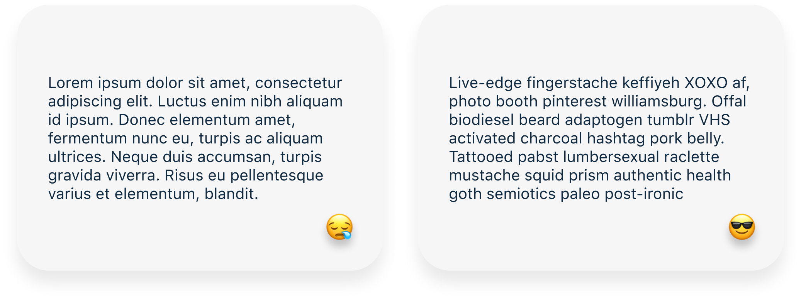

# Parrotxt
--

Using lorem ipsum is boring, so many designers are using it where it's starting to affect our designs negatively. That's why I created **Parrotxt** a simple and beautiful text generator that uses **REAL** text.

### 🚀 Go to app: <a href="https://parrotxt.netlify.com/" target="_blank">Parrotxt</a>
### 🐦 Follow me: <a href="https://twitter.com/eihab_khan" target="_blank">@eihab_khan</a>

## Credit
* <a href="https://thenounproject.com/" target="_blank">The Noun Project</a>
	* Logo designed by: Andrey Krylov
	* Icons designed by: Lyhn

	

